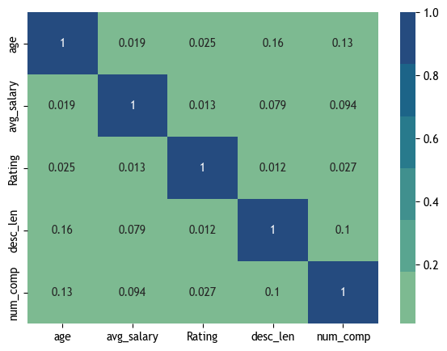
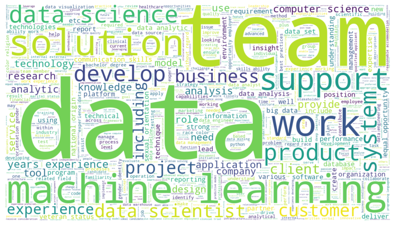

# Data Scientists' Salary Prediction

* Created a tool that estimates data science salaries (MAE ~ $ 11K) to help data scientists negotiate their income when they get a job.
* Scraped over 1000 job descriptions from glassdoor using python and selenium.
* Engineered features from the text of each job description to quantify the value companies put on Python, Excel, AWS, and Spark.
* Optimized Linear, Lasso, and Random Forest Regressors using GridsearchCV to reach the best model.

**Source:** [Data Science Project from Scratch by Ken Jee](https://www.youtube.com/playlist?list=PL2zq7klxX5ASFejJj80ob9ZAnBHdz5O1t)

## Data Collection

```python
import glassdoor_scrapper as gs
import pandas as pd

path= "data-scientists-salary/"

df=gs.get_jobs('Data Scientist', 1000, False, path, 15)
df.to_csv('glassdoor_jpbs.csv',index=False)
```

Used the `glassdoor_scrapper` to scrape 1000 job postings from glassdoor.com. With each job, we got the following:
* Job title
* Salary Estimate
* Job Description
* Rating
* Company
* Location
* Company Headquarters
* Company Size
* Company Founded Date
* Type of Ownership
* Industry
* Sector
* Revenue
* Competitors

## Data Cleaning

After scraping the data, it had to be cleaned so that it was usable for our model. The following changes were made:
* Parsed numeric data out of salary
* Made columns for employer provided salary and hourly wages
* Removed rows without salary
* Parsed rating out of company text
* Made a new column for company state
* Added a column for if the job was at the company’s headquarters
* Transformed founded date into age of company
* Made columns for if different skills were listed in the job description: Python, R, Excel, AWS, Spark
* Column for simplified job title and Seniority
* Column for description length

## Exploratory Data Analysis

The distributions of the data and the value counts for the various categorical variables were visualized. Below are a few highlights from the EDA:
* Correlation Heatmap



* Word cloud



## Model Building

Firstly, all the categorical variables were transformed into dummy variables. The data was split into training and testing sets in the 80:20 ratio.

Three different models were trained and evaluated using Mean Absolute Error (MAE) as tt is relatively easy to interpret and outliers are not particularly bad in for this type of model.

* Multiple Linear Regression
* Lasso Regression 
* Random Forest

## Model Evaluation

The Random Forest model far outperformed the other approaches on the test and validation sets.

* Random Forest: MAE = 11.22
* Linear Regression: MAE = 18.86
* Lasso Regression: MAE = 19.67
